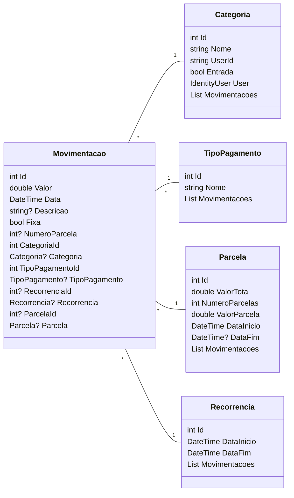

# ContaMente


API do Projeto de gerenciamento de finanças pessoais. ([Front-end](https://github.com/Ramon-Mateus/ContaMente))

# Diagrama de Classes



# Instalar
- .Net 8+: [Aqui](https://dotnet.microsoft.com/pt-br/download)
- Execute esse comando para baixar a ferramenta do Entity Framework para gerenciar migrations e updates no banco:
```shell
dotnet tool install --global dotnet-ef
```

## Docker

- Subir o container do Postgres:
```shell
docker run --name postgres -e POSTGRES_USER=admin -e POSTGRES_PASSWORD=SenhaForte123# -p 5432:5432 -d postgres
```

- Se já criou o container anteriormente, para subir novamente basta rodar esse comando:
```shell
docker start postgres
```

- Para verificar se o container subiu e rodou corretamente execute o comando abaixo no terminal e veja se o status está UP:
```shell
docker ps
```

_Adiante, para rodar o projeto basta estar na raiz e rodar os comandos abaixo em sequência. Eles vão, respectivamente, criar a migration e atualizar o banco e ,por fim, rodar o projeto._

## .Net

- Criar a migration
```shell
dotnet ef migrations add CreateTables
```

- Atualizar o banco com as migrations criadas
```shell
dotnet ef database update
```

- Rodar o projeto
```shell
dotnet run
```
